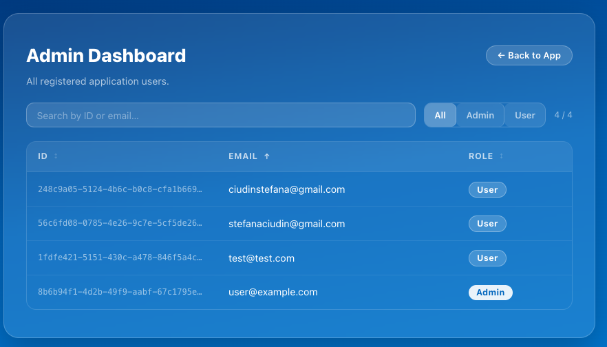
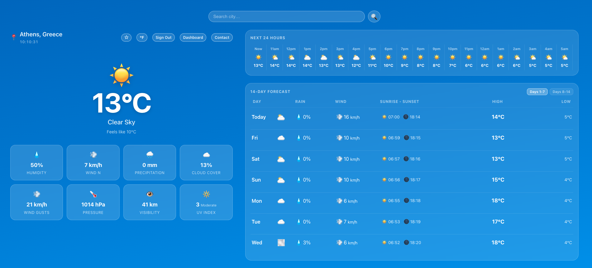
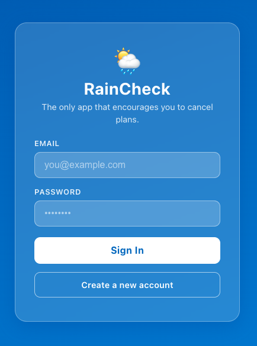
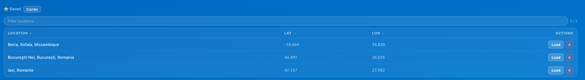
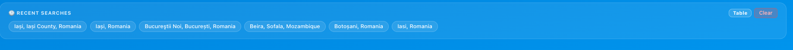

# Weather App

<!-- Add your main app screenshot or banner here -->


A React-based weather application built for my internship project. This application provides real-time weather updates, forecasts, user authentication, and the ability to save favorite locations and view search history.

## Features

- **Real-time Weather Data**: Get current weather conditions and forecasts for any location.
- **User Authentication**: Secure login and user sessions managed via Supabase.
- **Favorites & History**: Save your favorite locations and view your recent search history.
- **Interactive Dashboard**: A personalized dashboard for authenticated users.
- **Responsive Design**: Clean and responsive UI built with custom CSS.

## Screenshots

### Dashboard


### Weather Forecast


### Login Page


### Favorites


### History


## Tech Stack

- **Frontend Framework**: React (with Vite)
- **State Management**: Redux Toolkit (`authSlice`, `itemsSlice`, `uiSlice`)
- **Backend & Database**: Supabase (Authentication, Database)
- **Styling**: CSS

## Project Structure

```text
src/
├── Contact/       # Contact page components
├── Dashboard/     # User dashboard components
├── Landing/       # Landing page components
├── Login/         # Authentication components
├── store/         # Redux store and slices
├── Weather/       # Core weather features
│   ├── components/# Weather UI components (SearchBar, ForecastPanel, etc.)
│   ├── hooks/     # Custom React hooks (useWeather)
│   └── utils/     # API and utility functions
├── App.jsx        # Main application component
└── main.jsx       # Application entry point
```

## Getting Started

### Prerequisites

- Node.js (v16 or higher recommended)
- npm or yarn
- A Supabase project
- A Weather API key (e.g., OpenWeatherMap)

### Installation

1. **Clone the repository**
   ```bash
   git clone <repository-url>
   cd weather_app
   ```

2. **Install dependencies**
   ```bash
   npm install
   ```

3. **Environment Variables**
   Create a `.env` file in the root directory and add your API keys. The first two API keys are needed for the **Supabase** connection, while the latter are needed for the **EmailJS** connection, used in the **Contact** page.
   ```env
   VITE_SUPABASE_URL=your_supabase_project_url
   VITE_SUPABASE_ANON_KEY=your_supabase_anon_key
   VITE_EMAILJS_SERVICE_ID=your_email_js_service
   VITE_EMAILJS_TEMPLATE_ID=your_email_js_template
   VITE_EMAILJS_PUBLIC_KEY=your_email_js_key
   ```

4. **Run the development server**
   ```bash
   npm run dev
   ```
   The application will be available at `http://localhost:5173`.

## Scripts

- `npm run dev`: Starts the Vite development server.
- `npm run build`: Builds the app for production.
- `npm run preview`: Previews the production build locally.
